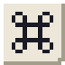
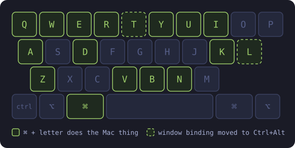

<p align="center">
  
</p>

<h1 align="center">omarchy-mac</h1>

<p align="center">
  <strong>Mac hands on Omarchy.</strong><br>
  ⌘ shortcuts, natural scrolling, gestures and Launchpad, in one file you can read.
</p>

<p align="center">
  <a href="https://github.com/tcballard/omarchy-badges"></a>
</p>

<p align="center">
  <a href="#install">Install</a> ·
  <a href="#keys">Keys</a> ·
  <a href="#trackpad">Trackpad</a> ·
  <a href="#launchpad">Launchpad</a> ·
  <a href="#how-it-works">How it works</a>
</p>

<p align="center">
  
</p>

Omarchy already gives you ⌘C, ⌘V and ⌘X. This adds the rest of what a Mac
user's hands reach for without thinking: select all, undo and redo, new tab, the
address bar, a ⌘W that closes the tab rather than the window, and a ⌘V that
pastes screenshots into Claude Code. Then the trackpad scrolls the right way and
Launchpad opens on a pinch.

- **⌘ + letter.** Twelve Mac shortcuts, each sent to the app as Ctrl + the same letter.
- **Tab-aware ⌘W.** Closes the tab, and the window once there is no tab left to close.
- **Image paste in terminals.** ⌘V sends Ctrl+V when the clipboard holds an image.
- **Mac key names.** ⌘K lists every shortcut as `Shift-Command-Return`, not `SUPER SHIFT + RETURN`.
- **Natural scrolling and gestures.** Three fingers between workspaces, four pinched in for Launchpad.
- **Launchpad.** Every installed app in a full-screen grid, recent ones on top.

Everything binds in one Lua file, [`hypr/omarchy-mac.lua`](hypr/omarchy-mac.lua),
so what a key does is one search away, and removing the file removes all of it.

## Install

Needs Omarchy 4 or newer, the release that configures Hyprland in Lua.

```bash
git clone https://github.com/nchudleigh/omarchy-mac.git ~/.local/share/omarchy-mac
~/.local/share/omarchy-mac/install.sh
```

Clone it wherever you keep code; the installer points back at the checkout, so
`git pull` and `hyprctl reload` is the whole update. Launchpad's QML changes
also need `omarchy restart shell`.

The installer stops rather than guessing when something is off: an Omarchy
without the Lua config, a missing `wl-paste` or `gawk`, or
[Macifier](https://github.com/omeganter/macifier) still active, which binds the
same keys and would make both fire.

<details>
<summary>What the installer touches, and removal</summary>

| Path | What it is |
|---|---|
| `~/.local/state/omarchy/toggles/hypr/omarchy-mac.lua` | One line that loads `hypr/omarchy-mac.lua` from the checkout |
| `~/.local/bin/mac-keybindings` | Link to `bin/mac-keybindings`, the ⌘K list |
| `~/.config/omarchy/plugins/mac-launchpad` | Link to `launchpad/`, enabled as `local.mac-launchpad` |
| `~/.local/state/omarchy-mac/` | Launchpad's recently opened apps |

Nothing is written to `~/.config/hypr` or `/usr/share/omarchy`.

```bash
~/.local/share/omarchy-mac/uninstall.sh
```

That disables Launchpad, removes all four paths and reloads Hyprland. Delete the
checkout afterwards if you like.

</details>

## Keys

Super is ⌘. On a Mac keyboard that is already the key beside Space; on a PC
keyboard it is the Windows key, unless you [move it](#putting--next-to-space).

| Keys | Does |
|---|---|
| ⌘A | Select all |
| ⌘Z / ⌘⇧Z / ⌘Y | Undo / redo / redo, Windows-style |
| ⌘B ⌘I ⌘U | Bold, italic, underline |
| ⌘N | New |
| ⌘T | New tab |
| ⌘L | Address bar |
| ⌘R | Reload |
| ⌘D | Duplicate, or bookmark in a browser |
| ⌘E | Search or edit, depending on the app |
| ⌘W | Close tab, then the window |
| ⌘Q | Close window |
| ⌘V | Paste, images included |
| ⌘K | Keybindings, in Mac key names |
| ⌘⌥A | Launchpad |

Two of these letters held Omarchy window bindings, which move one modifier along
rather than disappearing:

| Omarchy action | Was | Now |
|---|---|---|
| Toggle floating/tiling | Super+T | Ctrl+Alt+T |
| Toggle workspace layout | Super+L | Ctrl+Alt+L |

### In terminals

The ⌘-letter keys do nothing in a terminal. Ctrl+Z suspends a job, Ctrl+D closes
the shell and Ctrl+A moves to the start of the line, so sending them would be
worse than doing nothing. "Terminal" means Omarchy's own `terminal` window tag,
the same one its clipboard bindings use.

⌘W closes the terminal window, because Ctrl+W there deletes a word. ⌘V pastes
text with Shift+Insert, as Omarchy does, unless the clipboard holds an image:
then it sends Ctrl+V, which is what Claude Code and other terminal apps read an
image on. Checking the clipboard costs about 50 ms and gives up after 200 ms if
the app holding it does not answer.

### How ⌘W knows

Hyprland cannot see an app's tabs, so ⌘W sends Ctrl+W and looks again 300 ms
later. A closed tab changes the window title; a closed last tab, or an
unsaved-changes dialog, moves focus. Same window, same title means nothing
closed, and then it closes the window.

Browsers skip the second look. They close the window on the last tab themselves,
and two tabs called "New Tab" would otherwise read as nothing closing. The same
can happen in any other app with two identically titled tabs: ⌘W closes the
window instead of one of them.

### Putting ⌘ next to Space

On a PC keyboard, [`extras/keyd/mac-modifiers.conf`](extras/keyd/mac-modifiers.conf)
swaps Left Alt and the Windows key with [keyd](https://github.com/rvaiya/keyd), so
⌘ lands where a Mac keeps it:

```bash
omarchy pkg add keyd
sudo cp extras/keyd/mac-modifiers.conf /etc/keyd/default.conf
sudo systemctl enable --now keyd
```

It is not part of the install, because it changes every keyboard on the machine
and is wrong for an Apple one.

## Trackpad

| Gesture | Does |
|---|---|
| Two fingers | Scroll, naturally: content follows your fingers |
| Three fingers sideways | Move between workspaces, following your fingers |
| Four fingers pinched in | Launchpad |

Two fingers can never be a gesture here. libinput reads two fingers as scrolling
and only three or more as a swipe, so nothing in Hyprland ever sees a two-finger
swipe.

## Launchpad

**⌘⌥A** or a four-finger pinch opens every installed application in a full-screen
grid. It scrolls down like the Apps view that replaced Launchpad in macOS 26, with
the apps you last opened in a row on top, however you opened them.

Type to filter. Arrow keys walk the grid, Enter or a click launches, Escape clears
what you typed and a second Escape closes. Apps marked `NoDisplay` are left out,
which is what keeps MIME handlers and helper entries off the grid.

Recents are learned from Hyprland's window-open events and kept in
`~/.local/state/omarchy-mac/launchpad-recents.json`. Uninstalling deletes it.

## How it works

Omarchy loads `~/.local/state/omarchy/toggles/hypr/` after your own
`~/.config/hypr/bindings.lua`, so the bindings here win where both claim a key,
and every key they take over is released with `hl.unbind` first rather than left
to fire twice.

The file in that directory is one `dofile` line rather than a symlink, because
Omarchy lists the directory with `find -type f`, which skips symlinks.

## Deliberately absent

- **⌘Tab app switching.** Super+Tab stays Omarchy's workspace switcher. Moving
  workspace cycling to Super+Alt+Tab collides with Omarchy's next-window-in-group.
- **A dock.** Omarchy's launcher and Launchpad cover it.
- **⌘F, ⌘S, ⌘P, ⌘O, ⌘G.** Each holds an Omarchy window binding (full screen,
  scratchpad and so on) that people use daily. Copy the ⌘T pattern in the Lua
  file to take one.
- **Caps Lock as Caps Lock.** Omarchy makes it Compose, and the obvious fix, Compose
  on right ⌘, breaks anything bound to that key.
- **Media keys first on the top row.** That needs Apple's `hid_apple` driver and a
  root-owned file.

## Credits

Most of this is [Macifier](https://github.com/omeganter/macifier) by **Alvaro
Antolinez**, cut down to the parts used here at commit `cf9c0cd`: the ⌘-letter
table, the terminal rule, natural scrolling, the gestures, the Mac-named
keybindings list and Launchpad, which is his almost unchanged. Macifier does a
great deal more, from a dock to a ⌘Tab switcher, all switchable from the bar. If
you want the whole thing rather than this cut, install his.

The tab-aware ⌘W and the image-aware ⌘V are new here.

## Licence

[MIT](LICENSE), as Macifier is. Both copyright lines are in the file.
